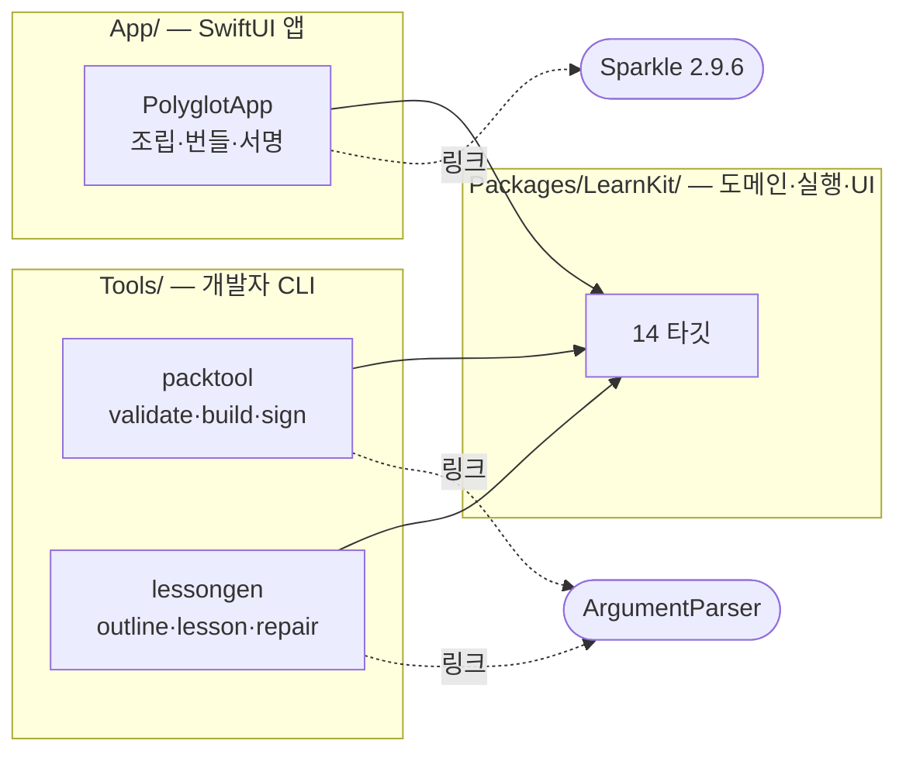
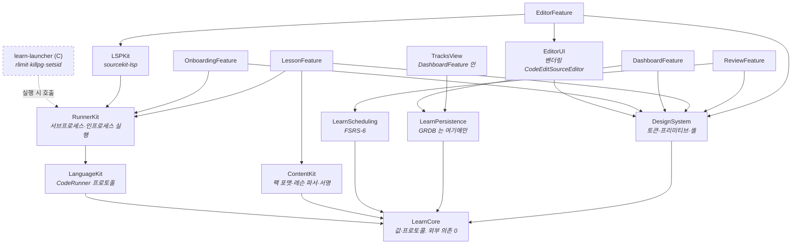
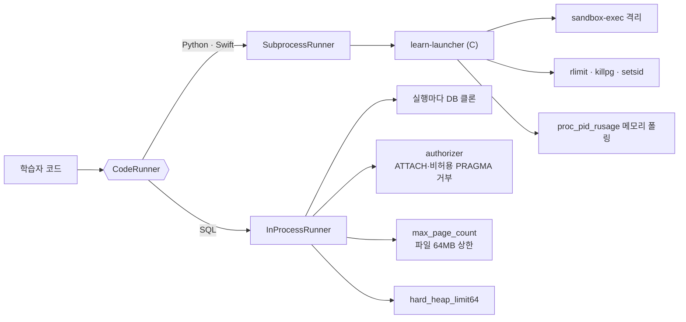
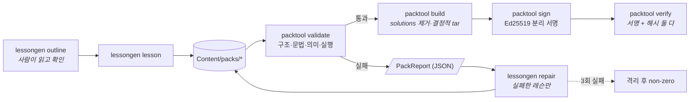

# Polyglot Study

Python · Rust · C++ · Go · Java · Next.js · TypeScript · SQL · Swift · Assembly, 10개 언어를
**각각 독립 트랙**으로 학습하는 macOS 네이티브 앱. 문서를 읽는 게 아니라 레슨 안에서 코드를
쓰고, 로컬 툴체인으로 실제로 실행하고, 채점을 받는다. MVP 범위는 **Python · SQL · Swift**
셋이다 — 이 셋이 서로 다른 실행 백엔드(서브프로세스 / 인프로세스 SQLite / 서브프로세스)에
걸쳐 있어 실행 추상화가 세 갈래 모두에서 검증된다.

macOS 14+ · Swift 6.3 / SwiftUI · MIT.

## 지금 어디까지 왔는가

**알파가 나갔다 — [v0.1.0-alpha.1](https://github.com/bunhine0452/polyglot-study/releases/tag/v0.1.0-alpha.1)**
([받기](https://bunhine0452.github.io/polyglot-study/) · macOS 14+ · Apple Silicon). 앱이 MVP 세 트랙 70편을 읽고
코드를 쓰고 채점까지 간다. **그 알파는 ad-hoc 서명**이라 첫 실행에 Gatekeeper 를 한 번
우회해야 한다. Developer ID 인증서를 확보해(2026-09-07) 서명·공증 배선을 끝냈으므로 —
다음 태그부터는 받아서 그냥 열면 된다.

| 영역 | 상태 |
|---|---|
| 코어 (스케줄러 · 실행 · 영속화) | **완료.** FSRS-6 복습 스케줄러, 6종 언어 백엔드를 아우르는 `CodeRunner` 프로토콜, GRDB 기반 저장소, sandbox-exec 격리 서브프로세스 러너·C 런처. SQL 은 인프로세스 SQLite 를 실행마다 클론해 돌리고 쓰기는 열되 파일 크기를 64MB 로 묶는다. `Packages/LearnKit` 테스트 1058개가 이를 검증한다. |
| 화면 | **앱에서 뜨는 것은 6개** — 온보딩(툴체인 진단) · 대시보드 · 트랙 · 레슨 · 에디터+콘솔(SQL 은 결과 diff) · 복습. 대시보드에서 트랙으로, 트랙의 레슨 목록에서 레슨으로, 레슨의 과제 블록에서 에디터로 이어진다. ARM64 레지스터 패널은 Assembly 트랙 착수까지 후순위다(`docs/milestones/`). |
| 에디터 | **앱에 붙었고 sourcekit-lsp 가 함께 뜬다.** 레슨의 과제 블록에서 열리고, 팩의 시작 코드를 싣고, 실행·제출이 진짜 백엔드(`swiftc`·`python3`·인프로세스 SQLite)를 탄다. Swift 트랙은 완성과 진단까지 동작한다(완성은 워밍 후 중앙값 28ms, 진단은 swiftc 와 같은 인라인 컴포넌트로 렌더하고 출처만 라벨로 구분). |
| 레슨 콘텐츠 | **다섯 트랙 122편 — 파이썬 24 · SQL 22 · Swift 24 · Rust 26 · C++ 26.** 122편 전부가 `packtool validate` 의 네 단계를 통과한다 — 예제는 실제로 실행돼 expected 와 바이트 대조되고, 과제는 solution 통과와 starter 실패를 둘 다 확인받는다. 다섯 팩은 앱 번들에 실려 첫 실행에 `PackStore` 로 설치된다. 나머지 5개 트랙(Go·Java·Next.js·TypeScript·Assembly)은 화면상 "준비 중" 으로 뜬다 — 그 언어들은 아직 실행기·채점기가 없다. |
| 콘텐츠 파이프라인 (`packtool`) | **완료.** `validate` 가 구조·문법·의미·실행 네 단계를 돌리고 예제는 expected 와 바이트 대조, 과제는 solution 통과와 **starter 실패**를 둘 다 확인한다. `build` 는 solutions 를 벗겨 결정적 tar 로 굽고(두 번 구우면 바이트 동일), `sign`/`verify` 가 Ed25519 분리 서명과 해시를 함께 본다. |
| 레슨 생성기 (`lessongen`) | **완료.** `outline` · `lesson` · `repair` 가 모두 돈다. 파이썬·SQL·Swift 70편이 이 루프로 만들어졌고, 실행 게이트가 결함을 잡아 `repair` 가 고쳤다 — 재검증 실패 0건. 레슨당 약 $0.005. |
| CI | **PR 필수 체크 5게이트.** `swift test` 셋(RunnerKit 직렬 · LearnKit 나머지 · Tools) · 앱 번들 조립 · `packtool validate` 가 PR 마다 돈다. PR #2 에서 다섯 잡이 병렬로 돌아 벽시계 약 9분이었다(최장은 RunnerKit 8분 25초). `lessongen` 은 크레딧이 나가므로 `workflow_dispatch` 전용이다. |
| 서명·배포 | **Sparkle 자동 업데이트 왕복 검증됨.** 구버전이 appcast 를 읽어 신버전을 받고 EdDSA 검증 후 설치까지 가는 것과, 서명이 어긋난 업데이트가 거부되는 것을 자동 테스트로 확인한다(`App/Scripts/verify-sparkle.sh`). **공증 통과** — `notarytool submit` 이 Accepted 를 받고 `stapler` 로 봉인한 뒤 `spctl` 이 **`Notarized Developer ID`** 로 읽는다(로컬 실측 2026-09-07). 스테이플 후에도 `codesign --verify --deep --strict` 가 통과한다. **CI 경로는 아직 태그로 증명하지 않았다** — 워크플로에 배선은 됐고 다음 태그가 첫 실행이다. DMG 는 아직이다. |

진행 상황의 항목별 근거는 `.oculpm/planner/polyglot-surface.md` 에 있고, 각 판단의 경위와
실측은 `.oculpm/journal/` 에 남아 있다.

## 스크린샷

실제로 빌드해 띄운 창을 찍은 것이다(합성 아님) — `App/Sources/PolyglotApp/Snapshot.swift`
가 `POLYGLOT_SNAPSHOT_PATH` 환경변수로 자기 창을 PNG 로 굽는다.

| 오늘(대시보드) | 툴체인 진단 | 복습 |
|---|---|---|
|  |  |  |

## 빌드 · 실행

Xcode 프로젝트가 없다 — 이유는 `App/Package.swift` 상단 주석에 적어 뒀다(요약: 앱 타깃이
파일 하나뿐이라 pbxproj 를 들고 다닐 이유가 없고, 서명·번들 레이아웃은 SPM 산출물로도 완전히
재현된다).

```bash
# 코어 라이브러리 테스트 — 870개, 경고 0
swift test --package-path Packages/LearnKit

# packtool·lessongen CLI 테스트 — 139개
swift test --package-path Tools

# 앱 번들을 만들고 실행 (서명까지 자동으로 됨 — 아래 참고)
App/Scripts/build-app.sh --run

# release 구성으로 빌드만
App/Scripts/build-app.sh --release
```

레슨 생성기(`lessongen`)를 쓰려면 OpenRouter API 키가 필요하다:

```bash
cp .env.example .env
# .env 에 OPENROUTER_API_KEY, OPENROUTER_MODEL 채우기
swift run --package-path Tools lessongen outline --language python --lessons 3
```

`.env` 는 `.gitignore` 로 막혀 있다 — 커밋되는 건 `.env.example` 뿐이다.

## 아키텍처

### 패키지 셋과 의존 방향

SPM 패키지 셋이다. **의존은 한 방향으로만 흐른다** — `LearnKit` 은 자기를 쓰는 쪽을 모른다.
그래서 `ArgumentParser` 는 CLI 산출물에만, `Sparkle` 은 앱 산출물에만 링크된다.



### LearnKit 내부

`LearnCore` 는 **아무것도 의존하지 않는 값·프로토콜 층**이다. GRDB 도 Subprocess 도 모른다.
저장소는 `LearnPersistence` 안에만, 프로세스는 `RunnerKit` 안에만 있다.



> `EditorFeature`(에디터+콘솔·SQL 결과 diff)는 `EditorUI`·`LSPKit` 과 함께 앱에 링크돼
> 있고, 레슨의 과제 블록에서 열린다.

### 학습자 코드는 어떻게 실행되는가

언어마다 격리 방식이 다르다. 하나의 `CodeRunner` 프로토콜 뒤에 두 백엔드가 있다.



SQL 이 인프로세스인 이유는 툴체인 의존을 0으로 만들기 위해서다 — `sqlite3` CLI 가 없는
머신에서도 SQL 트랙이 돈다. 쓰기는 **클론에 한해** 열려 있고(그래야 `INSERT`·`CREATE TABLE`
을 가르친다), 그 대가로 파일 크기 상한이 서 있다.

### 콘텐츠 파이프라인

생성기와 검증기는 **서로를 직접 의존하지 않는다.** 유일한 접점이 `PackReport` 다 —
생성기가 검증기의 내부를 알면 검증기의 약점을 우회하게 된다.



## 구조

```
App/                SwiftUI 앱 타깃. 화면은 전부 LearnKit 안에 있고 여기는 조립·번들링·서명만.
Packages/LearnKit/  코어 라이브러리 12개 타깃(LearnCore·RunnerKit·ContentKit·DesignSystem…).
Tools/               packtool·lessongen CLI. ArgumentParser 를 링크하는 산출물은 이쪽뿐 —
                     앱 바이너리는 링크하지 않는다.
Content/packs/       앱이 번들하는 콘텐츠 팩. 여기 있는 것만 배포본에 실린다.
Content/fixtures/    팩 포맷 스펙을 고정하는 픽스처(polyglot-mvp). 배포되지 않는다.
                     포맷 스펙은 docs/pack-format.md.
Vendor/              벤더링한 서드파티 소스(라이선스는 아래 참고).
design/              스위스 그리드 아트보드 — 화면 디자인의 근거.
docs/                포맷 스펙, 스크린샷.
.oculpm/             작업 계획·일지(ocul-pm). 사람 기여자가 직접 건드릴 필요는 없다 — 이
                     저장소가 AI 에이전트 세션으로 개발된 이력을 투명하게 남겨 둔 것이다.
```

## 서명·배포

`App/Scripts/build-app.sh` 가 매 빌드마다 서명까지 한다 — Hardened Runtime 을 켜고
(`codesign --options runtime`) App Sandbox 는 켜지 않는다(`App/Codesign/Polyglot.entitlements`
에 `com.apple.security.app-sandbox` 키 자체가 없다 — 로컬 툴체인을 서브프로세스로 실행해야
해서 샌드박스와는 애초에 안 맞는다. Mac App Store 배포는 이 때문에 포기했다).

번들에 들어가는 C 런처 헬퍼(`learn-launcher`, 서브프로세스에 rlimit 을 거는 실행 파일)는
`Contents/Helpers/` 에 앱과 **같은 신원으로 개별 서명**된다 — `--deep` 옵션 없이, 헬퍼를 먼저
서명하고 컨테이너를 나중에 서명하는 순서로. `codesign --verify --deep --strict` 가 헬퍼를
포함해 통과한다.

스크립트는 서명 신원을 `security find-identity -v -p codesigning` 에서 찾되 **이름으로**
고른다 — `Developer ID Application` 만 쓴다. 목록의 첫 줄을 집지 않는 이유는 Xcode 로
로그인하면 함께 생기는 `Apple Development:` 가 배포에 쓸 수 없는 신원이고, 그걸로 서명하면
실패가 한참 뒤 공증 단계에서야 드러나기 때문이다. 그 신원이 없으면 앱과 헬퍼 둘 다
**ad-hoc(`-`) 서명**으로 떨어지고, 무엇을 찾았는지 표준 출력에 찍는다.

Developer ID 로 서명할 때는 `--timestamp` 으로 보안 타임스탬프를 받는다(공증의 요구
조건). ad-hoc 은 공증 대상이 아니라 타임스탬프를 끈 채로 둬서 오프라인에서도 빌드가 돈다.

공증은 `App/Codesign/notarize.sh` 가 하고, `release.sh --notarize` 가 **zip 을 만들기
전에** 그것을 부른다 — `stapler` 는 zip 에 스테이플하지 못하므로 순서가 뒤바뀌면 appcast
해시가 실제 파일과 어긋난다. 자세한 것은 `docs/release.md` 의 서명·공증 절을 보라.

## 폰트

본문은 IBM Plex Sans KR, 코드·수치는 IBM Plex Mono 를 쓴다. `App/Resources/Fonts/` 에
정적 웨이트 3종(Regular·Medium·SemiBold) 씩 바이너리로 커밋돼 있다 — 두 폰트 합쳐 약 7.6MB.
전체 웨이트(8종 × hinted/unhinted)를 다 담으면 IBM Plex Sans KR 하나만 70MB 를 넘어가서,
실제 코드에서 쓰는 세 웨이트로 줄였다. 라이선스는 [폰트](#라이선스) 항목 참고.

앱은 `CTFontManagerRegisterFontsForURL` 로 프로세스 스코프 런타임 등록을 하고
(`App/Sources/PolyglotApp/FontRegistration.swift`), 배포용 번들에서는 `Info.plist` 의
`ATSApplicationFontsPath` 도 같은 파일을 가리켜 이중으로 동작한다 — 이유는 그 파일 안
주석에 있다(요약: `ATSApplicationFontsPath` 는 `.app` 으로 등록·실행됐을 때만 먹어서, `swift
run` 같은 비-번들 실행 경로는 런타임 등록이 없으면 폴백 폰트로 떨어진다).

## 라이선스

이 저장소 자체는 [MIT](LICENSE) 다.

**⚠ Unicorn Engine(GPL-2.0)을 실행 백엔드로 도입하면 이 MIT 선택은 무효화된다.** 아직
도입하지 않았고 지금 트리에 그 의존은 0건이지만, Assembly 트랙 에뮬레이션 백엔드 후보로
논의된 적이 있어(`.oculpm/discussion/mac-polyglot-learning-app/discussion.md`) 여기 경고를
남겨 둔다 — 붙이는 순간 배포 전체를 GPL-2.0 조건 아래로 옮기게 된다.

서드파티 고지는 [NOTICE](NOTICE) 에 모아 뒀다. 요약:

- **IBM Plex Sans KR / IBM Plex Mono** — SIL Open Font License 1.1 (Reserved Font Name
  "Plex"). `App/Resources/Fonts/LICENSE.txt` 에 전문이 있다.
- **CodeEditSourceEditor** — MIT. `Vendor/CodeEditSourceEditor` 에 로컬 벤더링(업스트림
  0.15.2 + 병합 대기 중인 PR #355 를 재현). 전문은 `Vendor/CodeEditSourceEditor/LICENSE`.
- **swift-fsrs** — MIT. `Packages/LearnKit/Sources/LearnScheduling/Vendor/FSRS` 에 커밋
  SHA 고정으로 벤더링(FSRS-6 이 릴리스 태그에는 없어서). 벤더링 경위는 같은 디렉터리의
  `VENDORING.md`.
- **CodeEditLanguages · CodeEditSymbols**(CodeEditSourceEditor 의 전이 의존) — 저장소에
  `LICENSE` 파일이 없다. CodeEdit 조직의 주요 저장소(CodeEdit·CodeEditSourceEditor·
  CodeEditTextView)는 전부 MIT 이고 README 태그라인이 "Open source, free forever" 라 정책이
  아니라 누락으로 판단하고 그대로 쓰고 있다 — 조직 쪽에 명시적 라이선스 확인을 구하는 것이
  안전한 다음 단계다.

기여 방법은 [CONTRIBUTING.md](CONTRIBUTING.md) 참고.
